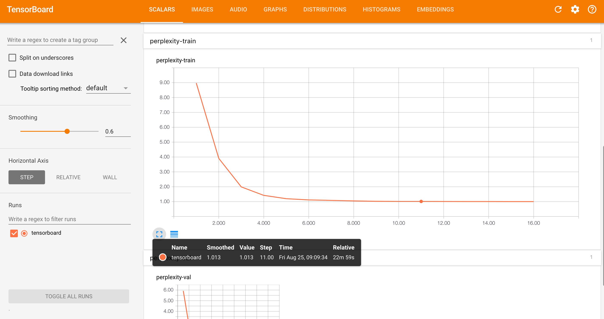

# WMT German to English news translation

In this tutorial we will train a German to English Sockeye model on a dataset from the [Conference on Machine Translation (WMT) 2017](http://www.statmt.org/wmt17/).

## Setup

Sockeye expects tokenized data as the input.
For this tutorial we use data that has already been tokenized for us.
However, keep this in mind for any other data set you want to use with Sockeye.
In addition to tokenization we will split words into subwords using Byte Pair Encoding (BPE).
In order to do so we use a tool called [subword-nmt](https://github.com/rsennrich/subword-nmt).
Run the following commands to set up the tool:

```bash
git clone https://github.com/rsennrich/subword-nmt.git
export PYTHONPATH=$(pwd)/subword-nmt:$PYTHONPATH
```

We will visualize training progress using Tensorboard.
Install it using:
```bash
pip install tensorboard
```

## GPU

All of the commands below assume you're running on a CPU.
If you have a GPU available you can simply remove `--use-cpu`.
With multiple GPUs you can use `torchrun` to spawn multiple training processes (see [WMT 2014 English-German tutorial](wmt_large.md)).

## Data

We will use the data provided by the WMT 2017 news translation shared task.
Download the data using the following commands:

```bash
wget http://data.statmt.org/wmt17/translation-task/preprocessed/de-en/corpus.tc.de.gz
wget http://data.statmt.org/wmt17/translation-task/preprocessed/de-en/corpus.tc.en.gz
gunzip corpus.tc.de.gz
gunzip corpus.tc.en.gz
curl http://data.statmt.org/wmt17/translation-task/preprocessed/de-en/dev.tgz | tar xvzf -
```

## Preprocessing

The data has already been tokenized. Additionally, we will split words into subwords.
First we need to build our BPE vocabulary:
```bash
python -m learn_joint_bpe_and_vocab --input corpus.tc.de corpus.tc.en \
                                    -s 30000 \
                                    -o bpe.codes \
                                    --write-vocabulary bpe.vocab.de bpe.vocab.en

```

This will create a joint source and target BPE vocabulary.
Next, we use apply the Byte Pair Encoding to our training and development data:

```bash
python -m apply_bpe -c bpe.codes --vocabulary bpe.vocab.de --vocabulary-threshold 50 < corpus.tc.de > corpus.tc.BPE.de
python -m apply_bpe -c bpe.codes --vocabulary bpe.vocab.en --vocabulary-threshold 50 < corpus.tc.en > corpus.tc.BPE.en

python -m apply_bpe -c bpe.codes --vocabulary bpe.vocab.de --vocabulary-threshold 50 < newstest2016.tc.de > newstest2016.tc.BPE.de
python -m apply_bpe -c bpe.codes --vocabulary bpe.vocab.en --vocabulary-threshold 50 < newstest2016.tc.en > newstest2016.tc.BPE.en
```

Looking at the data you can see how words are split into subwords separated by the special sequence `@@`:
```
Globaldarlehen sind Kreditlinien an zwischengeschaltete Institute -> Glob@@ al@@ dar@@ lehen sind Kredit@@ linien an zwischen@@ gesch@@ al@@ tete Institute
```

## Training

Having preprocessed our data we can start training.
Note that Sockeye will load all training data into memory in order to be able to easily reshuffle after every epoch.
Depending on the amount of RAM you have available you might want to reduce size of the training corpus for this tutorial:
```bash
# (Optional: run this if you have limited RAM on the training machine)
head -n 200000 corpus.tc.BPE.de > corpus.tc.BPE.de.tmp && mv corpus.tc.BPE.de.tmp corpus.tc.BPE.de
head -n 200000 corpus.tc.BPE.en > corpus.tc.BPE.en.tmp && mv corpus.tc.BPE.en.tmp corpus.tc.BPE.en
```

Before we start training we will prepare the training data by splitting it into shards and serializing it in matrix format:
```bash
python -m sockeye.prepare_data \
                        -s corpus.tc.BPE.de \
                        -t corpus.tc.BPE.en \
                        -o train_data \
                        --shared-vocab
```
While this is an optional step it has the advantage of considerably lowering the time needed before training starts and also limiting the memory usage as only one shard is loaded into memory at a time.


We can now kick off the training process:
```bash
python -m sockeye.train -d train_data \
                        -vs newstest2016.tc.BPE.de \
                        -vt newstest2016.tc.BPE.en \
                        --max-seq-len 60 \
                        --decode-and-evaluate 500 \
                        --use-cpu \
                        -o wmt_model \
                        --shared-vocab \
                        --max-num-epochs 3
```

This will train a "base" [Transformer](https://arxiv.org/abs/1706.03762) model.
There are also several parameters controlling training itself.
Unless you specify a different optimizer (`--optimizer`) [Adam](https://arxiv.org/abs/1412.6980) will be used.
Additionally, you can control the batch size (`--batch-size`), the learning rate schedule (`--learning-rate-schedule`) and other parameters relevant for training.

Training will run until the validation perplexity stops improving.
Sockeye starts a decoder in a separate process at every checkpoint running on the same device as training in order to evaluate metrics such as BLEU.
Note that these scores are calculated on the tokens provided to Sockeye, e.g. in this tutorial BLEU will be calculated on the sub-words we created above.
As an alternative to validation perplexity based early stopping you can stop early based on BLEU scores (`--optimized-metric bleu`).

To make sure the decoder finishes before the next checkpoint one can subsample the validation set for BLEU score calculation.
For example `--decode-and-evaluate 500` will decode and evaluate BLEU on a random subset of 500 sentences.
We sample the random subset once and keep it the same during training and also across trainings by fixing the random seed.
Therefore, validation BLEU scores across training runs are comparable.
Perplexity will not be affected by this and still be calculated on the full validation set.

Training a model on this data set is going to take a while.
In the next section we discuss how you can monitor the training progress.

### Monitoring training progress

There are basically three ways of tracking the training progress: the training log and log file, the metrics file and tensorboard.
In addition to printing training and validation metrics on stdout Sockeye also keeps track of them in the file `wmt_model/metrics`. Here you find all relevant metrics that were calculated during checkpointing.

Tensorboard allows for monitoring training and validation metrics in a browser.
Sockeye will log training events in a Tensorboard file that can be visualized with Tensorboard (`pip install tensorboard`)

```bash
tensorboard --logdir .
```

Once tensorboard is up and running you can check out the learning curves by opening [http://localhost:6006](http://localhost:6006).



Now even before training finishes you can already start translating with the model if at least one checkpoint has been written to disk.

## Translation

When translating with Sockeye it is important to keep in mind that it expects the same types of input as seen during training.
For this tutorial we fed in subword units that were obtained through a Byte Pair Encoding.
Therefore, we need to apply the same type of preprocessing before feeding a sentence into Sockeye.
All symbols that have not been seen during training will be replaced by an `<unk>` symbol.
When the `<unk>` symbol was observed during training one can that the model will also produce this symbol on the output.
Note though that because of the way we do the preprocessing with BPE above, the model will not actually observe any `<unk>` symbols.
In the following example we will use a sentence from the development set that is already tokenized and byte pair encode it.
After translation we merge consecutive byte pairs, resulting in a tokenized translated sentence.
This can be done by the following command:

```bash
echo "er ist so ein toller Kerl und ein Familienvater ." | \
  python -m apply_bpe -c bpe.codes --vocabulary bpe.vocab.en \
                                   --vocabulary-threshold 50 | \
  python -m sockeye.translate -m wmt_model 2>/dev/null | \
  sed -r 's/@@( |$)//g'

he is a great guy and a family father .
```

At decoding time Sockeye will run a beam search.
You can set the size of the beam (`--beam-size`) or change other decoding parameters such as `--softmax-temperature` and `--length-penalty-alpha`.


### Embedding inspection

You can inspect the embeddings learned by the model during training. Sockeye includes a tool to compute pairwise similarities (Euclidean distance) for all types in the embeddings space.
Given a query token, it returns the nearest neighbors in the space.
You can run it like this:

```
echo "haus" | python3 -m sockeye.embeddings -m wmt_model -s source
[INFO:__main__] Arguments: Namespace(checkpoint=None, gamma=1.0, k=5, model='wmt_model', norm=False, side='source')
Input: haus
haus id=35
  gebaeude id=68 sim=0.8498
  Haus id=1759 sim=0.1441
  hauser id=295 sim=0.0049
```
(Your own output may look different)


### Model ensembling

Deep learning models usually profit from model ensembling.
In model ensembling we train multiple models with different seeds (`sockeye.train` has an argument `--seed`).
After that we can just provide these models to the Sockeye translation CLI:

```bash
echo "er ist so ein toller Kerl und ein Familienvater ." | \
  python -m apply_bpe -c bpe.codes --vocabulary bpe.vocab.en \
                                   --vocabulary-threshold 50 | \
  python -m sockeye.translate --use-cpu -m wmt_model wmt_model_seed2 wmt_model_seed3 2>/dev/null | \
  sed -r 's/@@( |$)//g'

he is a great guy and a family father .
```

As we haven't trained multiple models yet we can simply feed in the same model multiple times:
```bash
echo "er ist so ein toller Kerl und ein Familienvater ." | \
  python -m apply_bpe -c bpe.codes --vocabulary bpe.vocab.en \
                                   --vocabulary-threshold 50 | \
  python -m sockeye.translate --use-cpu -m wmt_model wmt_model wmt_model 2>/dev/null | \
  sed -r 's/@@( |$)//g'

he is a great guy and a family father .
```

Internally Sockeye will run each one of the models and combine the predictions.
If all the models are the same you will of course get the same predictions at the expense of running the same model multiple times. However, the point is mainly to show how one would run an ensemble model.

## Checkpoint averaging

An alternative to model ensembling that does not require training multiple models is to average parameters from different checkpoints.
While unlike ensembling basically coming at no cost, this usually leads to smaller gains.
Of course you could also create an ensemble of checkpoint averaged models.
Sockeye provides a CLI that combines the parameter files of a trained model.
In the following we create a copy of the model directory and then replace the link to the best parameters with an checkpointed averaged parameter file:

```bash
cp -r wmt_model wmt_model_avg
python -m sockeye.average -o wmt_model_avg/param.best wmt_model
```

## Summary

Congratulations! You have successfully trained your first real Sockeye translation model.
On top of that you know how to track training progress, how to translate, how to combine models through checkpointing or ensembling and more.
